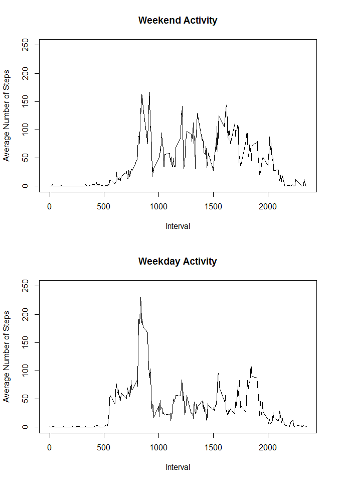

# Reproducible Research: Peer Assessment 1

## Loading and preprocessing the data
### Unzip the compressed data file


```r
unzip("./activity.zip", overwrite = TRUE)
```

- Read the data from the uncompressed activity.csv file into a variable "data"

```r
data <- read.csv("./activity.csv")
```

## What is mean total number of steps taken per day?

### Calculate the total number of steps taken per day

```r
stepsPerDay <- aggregate(steps ~ date, data, sum)
```

### Make a histogram of the total number of steps taken each day

```r
hist(stepsPerDay$steps,main="Historgram of Steps Taken per Day",xlab = "Steps per Day")
```

 

### Calculate and report the mean and median of the total number of steps taken per day

```r
meanStepsPerDay <- mean(stepsPerDay$steps, na.rm = TRUE)
medianStepsPerDay <- median(stepsPerDay$steps, na.rm = TRUE)
```
Mean steps taken per day: 10766.19

Median steps taken per day: 10765


## What is the average daily activity pattern?
### Make a time series plot (i.e. type = "l") of the 5-minute interval (x-axis) and the average number of steps taken, averaged across all days (y-axis)

```r
averageStepsPerInterval <- aggregate(steps ~ interval, data, mean)
plot(averageStepsPerInterval, type = "l")
```

 

### Which 5-minute interval, on average across all the days in the dataset, contains the maximum number of steps?

```r
maxStepsInterval <- averageStepsPerInterval[averageStepsPerInterval$steps == max(averageStepsPerInterval$steps),1]
```
The interval with the maximum number of steps is interval: 835

## Imputing missing values
### Calculate and report the total number of missing values in the dataset (i.e. the total number of rows with NAs)

```r
incompleteRowCount <- sum(complete.cases(data) == FALSE)
```
Number of incomplete rows: 2304


### Devise a strategy for filling in all of the missing values in the dataset. The strategy does not need to be sophisticated. For example, you could use the mean/median for that day, or the mean for that 5-minute interval, etc.
To fill in missing values, we will replace any missing value with its respective 5-minute interval average.

### Create a new dataset that is equal to the original dataset but with the missing data filled in.
The following function fillMissingData accepts a given number of steps and interval as arguments.
If the number of steps is null, the interval argument is used to retrieve the respective 5-minute
step average. This function is used to replace all missing values in the original data set.

```r
filledData <- data
fillMissingData <- function(steps, interval) {
    filled <- NA
    if (!is.na(steps))
        filled <- c(steps)
    else
        filled <- (averageStepsPerInterval[averageStepsPerInterval$interval==interval, "steps"])
    return(filled)
}
filledData <- data
filledData$steps <- mapply(fillMissingData, filledData$steps, filledData$interval)
```

### Make a histogram of the total number of steps taken each day and Calculate and report the mean and median total number of steps taken per day. Do these values differ from the estimates from the first part of the assignment? What is the impact of imputing missing data on the estimates of the total daily number of steps?

```r
stepsPerDayFilled <- aggregate(steps ~ date, filledData, sum)
hist(stepsPerDayFilled$steps,
     main="Historgram of Steps Taken per Day (Filled Missing Values)",
     xlab = "Steps per Day")
```

 

```r
meanStepsPerDayFilled <- mean(stepsPerDayFilled$steps)
medianStepsPerDayFilled <- median(stepsPerDayFilled$steps)
```
Mean steps taken per day (filled data): 10766.19

Median steps taken per day (filled data): 10766.19

Imputing the missing data with the 5-minute interval averages had almost no impact to the
mean and median. This is expected since the incorporation of more "average" data into
the data set would not shift the mean or median. The only difference is that the height
of the middle historgram bar is higher due to the increased frequency of data observations
near the mean.

## Are there differences in activity patterns between weekdays and weekends?

### Create a new factor variable in the dataset with two levels - "weekday" and "weekend" indicating whether a given date is a weekday or weekend day.

```r
filledDataDayType <- filledData
filledDataDayType$daytype = "weekday"
filledDataDayType$daytype[weekdays(as.POSIXlt(filledDataDayType$date)) == "Sunday"] = "weekend"
filledDataDayType$daytype[weekdays(as.POSIXlt(filledDataDayType$date)) == "Saturday"] = "weekend"
```


### Make a panel plot containing a time series plot (i.e. type = "l") of the 5-minute interval (x-axis) and the average number of steps taken, averaged across all weekday days or weekend days (y-axis).

```r
averageStepsPerIntervalDayType <- aggregate(steps ~ interval+daytype, filledDataDayType, mean, na.rm=TRUE)

averageStepsPerIntervalWeekend <- 
    averageStepsPerIntervalDayType[averageStepsPerIntervalDayType$daytype == "weekend",]
averageStepsPerIntervalWeekday <- 
    averageStepsPerIntervalDayType[averageStepsPerIntervalDayType$daytype == "weekday",]

par(mfrow=c(2,1))

plot(averageStepsPerIntervalWeekend$interval,
     averageStepsPerIntervalWeekend$steps,
     type = "l",
     main = "Weekend Activity",
     xlab = "Interval",
     ylab = "Average Number of Steps",
     ylim = c(0,250))

plot(averageStepsPerIntervalWeekday$interval,
     averageStepsPerIntervalWeekday$steps,
     type = "l",
     main = "Weekday Activity",
     xlab = "Interval",
     ylab = "Average Number of Steps",
     ylim = c(0,250))
```

 
